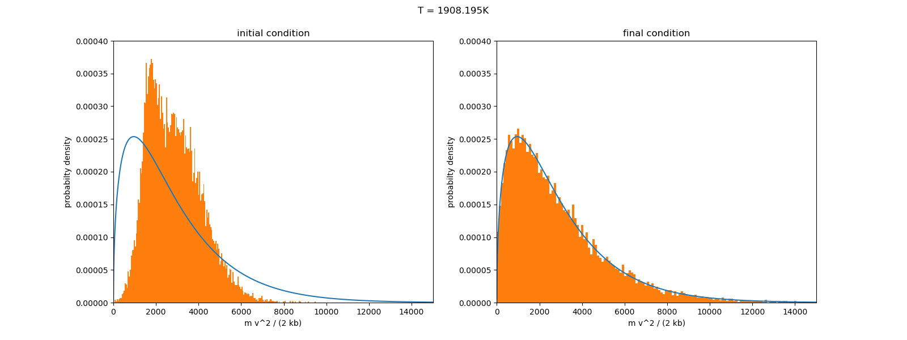
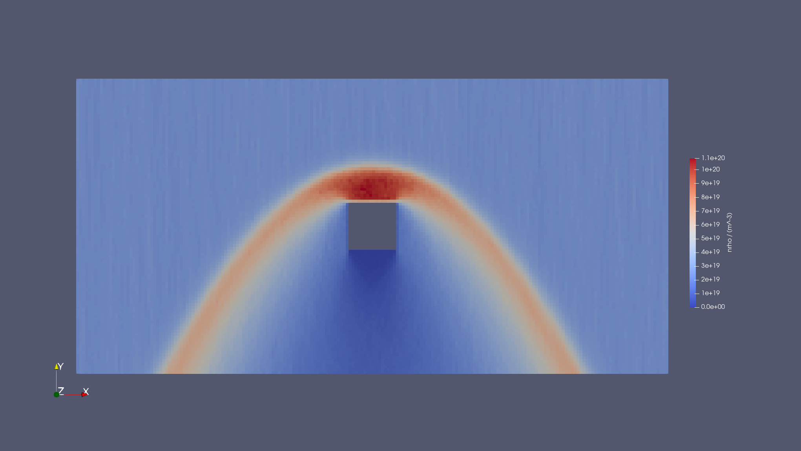
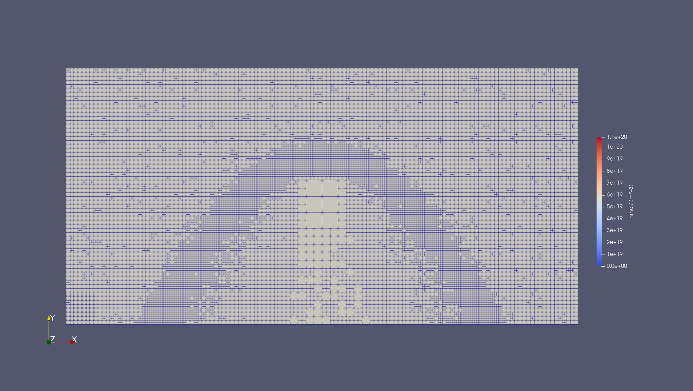
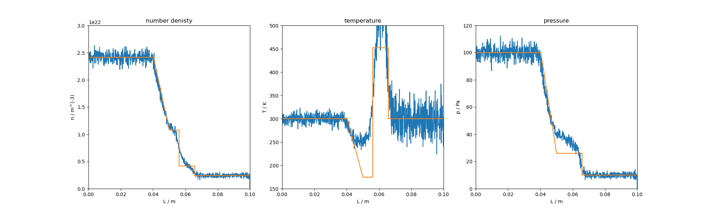

# Octree based DSMC - Python implementation

# Table of Contents
1. Introduction
2. Requirements
3. Installation
4. Test Cases

# 1. Introduction
DSMC implementation using an octree as a variable mesh based on https://doi.org/10.1016/j.jcp.2008.04.038.
Implementation in done in python 3.10.

# 2. Requirements
- python 3.10.
- pip3
- numpy
- llvmlite
- scipy
- numba

# 3. Installation
The module can be installed using pip3 from the repository root as

``
pip3 install .
``

# 4. Test Cases
All test cases were performed using Argon.
The gas properties are as follows:

| gas | $\sigma_T / m^2$ | $m / kg$   | 
|:---:|:----------------:|:----------:|
| Ar  | 3.631681e-19     | 6.6422e-26 |

## 4.1 Heat Bath
Simulation of temperature relaxation of Argon in closed domain.
The simulation domain is cube with a side length of $2 \cdot 10^{-3} m$.
The simulation properties are as follows

| $\Delta t / s$ | $w$    | $T / K$ | $n / m^{-3}$ | $u / (m/s)$ |
|:--------------:|:------:|:-------:|:------------:|:-----------:|
| 1e-5           | 0.5e-8 | 300     | 1e+20        | 1000.0      |

where $\Delta t$ is the time step, $w$ is the particle weight, $T$  the temperature, $n$ the number density and $u$ the velocity in x direction.
The simulation results can be seen below.

## 4.2 Hypersonic flow around cube
Hypersonic flow around a cuboid.
The parameters are as follows

| $\Delta t / s$ | $w$      | $T / K$ | $n / m^{-3}$ | $v_{x, z} / (m s^{-1})$ | $v_y / (m s^{-1})$ |
|:--------------:|:--------:|:-------:|:------------:|:-----------------------:|:------------------:|
| 1e-6           | 0.25e+15 | 273.0   | 2.6e+19      | 0                       | -3043.0            |

## 4.3 Shock Tube

This test case is Sod's shock tube problem.
Initial conditions for the left hand side $C_L$ and the right hand side $C_R$ are found below

$$
C_L = 
\begin{pmatrix}
n_L \\
u_L \\
T_L \\
\end{pmatrix} =
\begin{pmatrix}
2.41432e22 \\
0 \\
300 \\
\end{pmatrix}
$$

$$
C_R = 
\begin{pmatrix}
n_R \\
u_R \\
p_L \\
\end{pmatrix}=
\begin{pmatrix}
2.41432e21 \\
0 \\
300 \\
\end{pmatrix}
$$

The simulation parameters

| $\Delta t / s$ | $w$  |
|:--------------:|:----:|
| 1e-7           | 1e-8 |

The simulation domain is a rectangular tube with a square cross section with the side length $2 \cdot 10^{-4} m$ and a length of $0.1 m$.
Results can be seen below.

