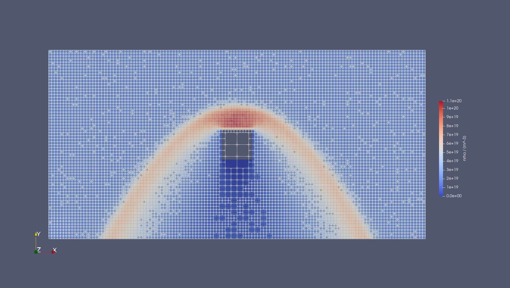

# Octree based DSMC - Python implementation

# Table of Contents
1. Introduction
2. Requirements
3. Installation
4. Test Cases

# 1. Introduction
DSMC implementation using an octree as a variable mesh.
Implementation in done in python 3.10.

# 2. Requirements
- python 3.10.
- pip

# 3. Installation
ToDo

# 4. Test Cases

## 4.1 Heat Bath
ToDo

## 4.2 Hypersonic flow around cube
ToDo

## 4.3 Shock Tube

ToDo
